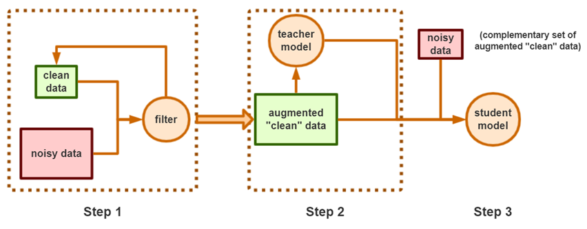

# PUDistill

PyTorch code for the following paper:

**Title**: Training Classifiers that are Universally Robust to All Label Noise Levels.

**Authors**: Jingyi Xu, Tony Q. S. Quek and Kai Fong Ernest


To train classifiers that are universally robust to all noise levels, and that are not sensitive to any variation in the noise model, we propose a distillation-based framework that incorporates a new subcategory of Positive-Unlabeled learning. In particular, we shall assume that a small subset of any given noisy dataset is known to have correct labels, which we treat as “positive”, while the remaining noisy subset is treated as “unlabeled”. Our framework consists of the following 3 steps: (1) We shall generate, via iterative updates, an augmented clean subset with additional reliable “positive” samples filtered from “unlabeled” samples; (2) We shall train a teacher model on this larger augmented clean set; (3) With the guidance of the teacher model, we then train a student model on the whole dataset.



## Requirements

- Python 3.6
- Pytorch 1.4.0

## Training

#### Hyper-parameters:

- ##### CIFAR-10

  + **N_bagging** (number of binary classifiers for each class): 20
  + **K_iteration** (number of iterations to augment clean set): 10
  + **threshold** (decision threshold of binary classifiers): 0.9
  + **add_criterion** (criterion of moving an unsure sample to clean set): 19

  For symmetric noise:

| Parameter\Noise Level | 30%  | 40%  | 50%  | 60%  | 70%  | 80%  | 90%  |
| --------------------- | ---- | ---- | ---- | ---- | ---- | ---- | ---- |
| **student_lambda**    | 0.4  | 0.5  | 0.5  | 0.5  | 0.9  | 0.9  | 0.9  |
| **eta**               | 0.8  | 0.9  | 0.6  | 0.5  | 0.6  | 0.5  | 0.5  |

​		For asymmetric noise:

| Parameter\Noise Level | 30%  | 40%  | 50%  | 60%  | 70%  | 80%  | 90%  |
| --------------------- | ---- | ---- | ---- | ---- | ---- | ---- | ---- |
| **student_lambda**    | 0.4  | 0.4  | 0.5  | 0.7  | 0.8  | 0.9  | 0.9  |
| **eta**               | 0.8  | 0.6  | 0.5  | 0.5  | 0.5  | 0.5  | 0.5  |


- ##### Clothing1M

  + **N_bagging**: 10
  + **K_iteration**: 6
  + **threshold**: 0.95
  + **add_criterion**: 10
  + **student_lambda**: 0.5
  + **eta**: 0.8


#### Examples:

- ##### CIFAR-10 (given 10% clean set, symmetric noise level=70%):

```
python generate_clean_set_cifar.py --clean_data_ratio 0.1 --threshold 0.9 --add_criterion 19 --N_bagging 20 --K_iteration 10
python teacher_cifar.py --n 5 --mixup --entropy_reg
python student_cifar.py  --noise_type syn --noise_level 0.7 --label_type soft_bootstrap --student_lambda 0.8
```

- ##### Clothing1M:

```
python generate_clean_set_clothing.py --threshold 0.95 --add_criterion 9 --N_bagging 10 --K_iteration 5
python teacher_clothing.py --n 5 --mixup
python student_clothing.py --label_type soft_bootstrap --student_lambda 0.8
```


## Results

#### Accuracies on CIFAR10 with symmetric synthetic noise (average of 5 trials)

| Algorithm\Noise Level | 30%   | 40%   | 50%   | 60%   | 70%   | 80%   | 90%   |
| --------------------- | ----- | ----- | ----- | ----- | ----- | ----- | ----- |
| SOTA                  | 95.95 | 94.66 | 94.85 | 94.89 | 94.14 | 93.21 | 61.62 |
| Our Method            | 90.67 | 89.46 | 88.39 | 87.34 | 86.31 | 85.92 | 85.73 |


#### Accuracies on CIFAR10 with asymmetric synthetic noise (average of 5 trials)

| Algorithm\Noise Level | 30%   | 40%   | 50%   | 60%   | 70%   | 80%   | 90%   |
| --------------------- | ----- | ----- | ----- | ----- | ----- | ----- | ----- |
| SOTA                  | 93.95 | 89.56 | 84.56 | 78.21 | 76.70 | 76.44 | 76.00 |
| Our Method            | 90.76 | 89.63 | 88.56 | 87.53 | 86.80 | 86.32 | 85.97 |


#### Accuracies on Clothing1M

| Algorithm  | Accuracy |
| ---------- | -------- |
| SOTA       | 74.76    |
| Our Method | 77.70    |

